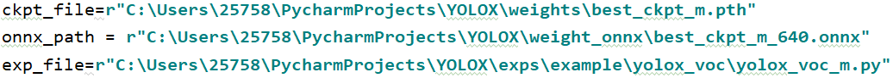
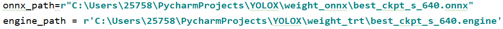

## 一、目录说明

### datasets

执行python make_dir.py，生成数据集存放文件。

Annotations：存放标签文件；

JPEGImages：存放图像数据；

ImageSets/Main：存放用于划分训练和测试的数据。

> 注意：训练时，图像必须时jpg格式，并且文件名称不能有空格。
>
> 数据是VOC2007格式

### exps

exps\example\yolox_voc：存放训练配置文件。

### test

存放测试图像

### tools

存放训练、测试的入口文件，以及转onnx、转tensorrt的python脚本

### yolox

存放与yolox模型有关的文件，比如数据加载器、数据增强、训练器、可视化等。

### YOLOX_outputs

存放训练、测试的结果。

## 二、主要过程说明

注意1：训练时，会在datasets/VOCdevkit目录下生成results和annotations_cache缓存文件，如果你打算开始一个新的模型训练，必须将这两个文件内容删除，否则训练的还是上一次的模型。

注意2：如果提醒找不到某个自定义的包，在运行脚本中的开头添加

```python
import sys
sys.path.append("项目路径")
```

### 2.1 训练

tools/train.py

```bash
python tools/train.py -f exps/example/yolox_voc/yolox_voc_m.py -d 1 -b 32 -c weights/yolox_m.pth --device cuda:0
# -f 指定训练的配置文件
# -d 表示一张卡
# -b batch_size
# -c 权值文件
# --device 指定显卡
```

训练时，会自动生成YOLOX_outputs文件

### 2.2 测试

tools/demo.py

#### 2.2.1 pth测试

```bash
python tools/demo.py image -f exps\example\yolox_voc\yolox_voc_m.py -c weights/best_ckpt.pth --device gpu --save_result --path assets
# image 表示测试图像
# -f 配置文件
# -c 权值文件
# --device 指定测试设备
# --save_result 保存结果，默认保存到YOLOX_outputs/yolox_voc_x/vis_res
# --path 指定测试图像的路径
```

#### 2.2.2 tensorrt测试

```bash
python tools/demo.py image -f exps\example\yolox_voc\yolox_voc_m.py --trt -c weights/model_trt.engine --save_result --path assets
# image 表示测试图像
# -f 配置文件
# -c 权值文件
# --trt 表示tensorrt推理
# --save_result 保存结果，默认保存到YOLOX_outputs/yolox_voc_x/vis_res
# --path 指定测试图像的路径
```

### 2.3 转onnx

tools/tensor2onnx.py



需要修改的三个路径：

ckpt_file：pth文件路径

onnx_path：生成的onnx文件存放路径

exp_file：配置文件路径

设置好这三个路径后，直接**python tensor2onnx.py**运行

### 2.4 转tensorrt

tools/onnx2trt.py



需要修改这两个路径文件。

## 三、配置文件重要参数

exps/example/yolox_voc

配置文件存放在上面路径下，它们继承自yolox/exp/yolox_base.py。这些文件中存放，训练参数配置，比如input_size、max_epoch、learning_rate等，还提供get_model方法，用于获得模型对象。

```bash
num_classes 类别数
depth width 用于区别s、m、l、x模型
input_size 图像的长边会与该值对齐，短边等比例变换
multiscale_range 多尺度的变换范围，计算公式[x - 5 * 32, x + 5 * 32] x是长边长度
max_epoch 训练的最大epoch
basic_lr_per_img 学习率计算公式basic_lr_per_img*batch_size
no_aug_epochs 不进行数据增强的epoch数量（倒数）
eval_interval 测试的epoch间隔
test_size 测试的input_size
```

## 四、Benchmark

#### Standard Models.

|Model |size |mAP<sup>val<br>0.5:0.95 |mAP<sup>test<br>0.5:0.95 | Speed V100<br>(ms) | Params<br>(M) |FLOPs<br>(G)| weights |
| ------        |:---: | :---:    | :---:       |:---:     |:---:  | :---: | :----: |
|[YOLOX-s](./exps/default/yolox_s.py)    |640  |40.5 |40.5      |9.8      |9.0 | 26.8 | [github](https://github.com/Megvii-BaseDetection/YOLOX/releases/download/0.1.1rc0/yolox_s.pth) |
|[YOLOX-m](./exps/default/yolox_m.py)    |640  |46.9 |47.2      |12.3     |25.3 |73.8| [github](https://github.com/Megvii-BaseDetection/YOLOX/releases/download/0.1.1rc0/yolox_m.pth) |
|[YOLOX-l](./exps/default/yolox_l.py)    |640  |49.7 |50.1      |14.5     |54.2| 155.6 | [github](https://github.com/Megvii-BaseDetection/YOLOX/releases/download/0.1.1rc0/yolox_l.pth) |
|[YOLOX-x](./exps/default/yolox_x.py)   |640   |51.1 |**51.5**  | 17.3    |99.1 |281.9 | [github](https://github.com/Megvii-BaseDetection/YOLOX/releases/download/0.1.1rc0/yolox_x.pth) |
|[YOLOX-Darknet53](./exps/default/yolov3.py)   |640  | 47.7 | 48.0 | 11.1 |63.7 | 185.3 | [github](https://github.com/Megvii-BaseDetection/YOLOX/releases/download/0.1.1rc0/yolox_darknet.pth) |

<details>
<summary>Legacy models</summary>

|Model |size |mAP<sup>test<br>0.5:0.95 | Speed V100<br>(ms) | Params<br>(M) |FLOPs<br>(G)| weights |
| ------        |:---: | :---:       |:---:     |:---:  | :---: | :----: |
|[YOLOX-s](./exps/default/yolox_s.py)    |640  |39.6      |9.8     |9.0 | 26.8 | [onedrive](https://megvii-my.sharepoint.cn/:u:/g/personal/gezheng_megvii_com/EW62gmO2vnNNs5npxjzunVwB9p307qqygaCkXdTO88BLUg?e=NMTQYw)/[github](https://github.com/Megvii-BaseDetection/storage/releases/download/0.0.1/yolox_s.pth) |
|[YOLOX-m](./exps/default/yolox_m.py)    |640  |46.4      |12.3     |25.3 |73.8| [onedrive](https://megvii-my.sharepoint.cn/:u:/g/personal/gezheng_megvii_com/ERMTP7VFqrVBrXKMU7Vl4TcBQs0SUeCT7kvc-JdIbej4tQ?e=1MDo9y)/[github](https://github.com/Megvii-BaseDetection/storage/releases/download/0.0.1/yolox_m.pth) |
|[YOLOX-l](./exps/default/yolox_l.py)    |640  |50.0  |14.5 |54.2| 155.6 | [onedrive](https://megvii-my.sharepoint.cn/:u:/g/personal/gezheng_megvii_com/EWA8w_IEOzBKvuueBqfaZh0BeoG5sVzR-XYbOJO4YlOkRw?e=wHWOBE)/[github](https://github.com/Megvii-BaseDetection/storage/releases/download/0.0.1/yolox_l.pth) |
|[YOLOX-x](./exps/default/yolox_x.py)   |640  |**51.2**      | 17.3 |99.1 |281.9 | [onedrive](https://megvii-my.sharepoint.cn/:u:/g/personal/gezheng_megvii_com/EdgVPHBziOVBtGAXHfeHI5kBza0q9yyueMGdT0wXZfI1rQ?e=tABO5u)/[github](https://github.com/Megvii-BaseDetection/storage/releases/download/0.0.1/yolox_x.pth) |
|[YOLOX-Darknet53](./exps/default/yolov3.py)   |640  | 47.4      | 11.1 |63.7 | 185.3 | [onedrive](https://megvii-my.sharepoint.cn/:u:/g/personal/gezheng_megvii_com/EZ-MV1r_fMFPkPrNjvbJEMoBLOLAnXH-XKEB77w8LhXL6Q?e=mf6wOc)/[github](https://github.com/Megvii-BaseDetection/storage/releases/download/0.0.1/yolox_darknet53.pth) |

</details>

#### Light Models.

|Model |size |mAP<sup>val<br>0.5:0.95 | Params<br>(M) |FLOPs<br>(G)| weights |
| ------        |:---:  |  :---:       |:---:     |:---:  | :---: |
|[YOLOX-Nano](./exps/default/nano.py) |416  |25.8  | 0.91 |1.08 | [github](https://github.com/Megvii-BaseDetection/YOLOX/releases/download/0.1.1rc0/yolox_nano.pth) |
|[YOLOX-Tiny](./exps/default/yolox_tiny.py) |416  |32.8 | 5.06 |6.45 | [github](https://github.com/Megvii-BaseDetection/YOLOX/releases/download/0.1.1rc0/yolox_tiny.pth) |


<details>
<summary>Legacy models</summary>

|Model |size |mAP<sup>val<br>0.5:0.95 | Params<br>(M) |FLOPs<br>(G)| weights |
| ------        |:---:  |  :---:       |:---:     |:---:  | :---: |
|[YOLOX-Nano](./exps/default/nano.py) |416  |25.3  | 0.91 |1.08 | [github](https://github.com/Megvii-BaseDetection/storage/releases/download/0.0.1/yolox_nano.pth) |
|[YOLOX-Tiny](./exps/default/yolox_tiny.py) |416  |32.8 | 5.06 |6.45 | [github](https://github.com/Megvii-BaseDetection/storage/releases/download/0.0.1/yolox_tiny_32dot8.pth) |
